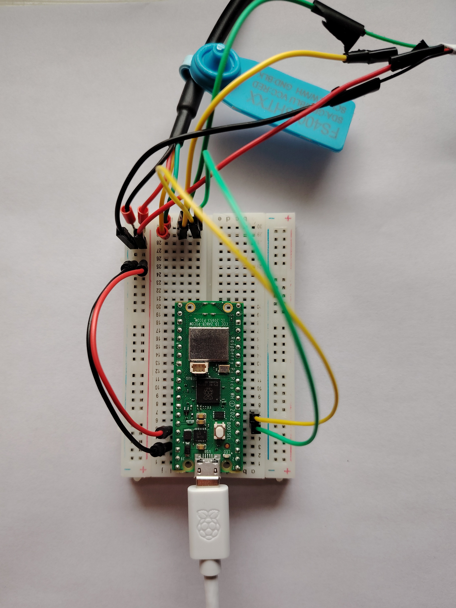

# pico-weather

A weather station for Raspberry Pi Pico W. It uses MQTT to send sensor data from the Pico to a Express server which processes it, saves it to a MongoDB database, and finally distributes it via an API. The data can be viewed directly through the backend API, or graphically by using the provided frontend application. Different kinds of weather data are available currently: temperature, humidity, daylight intensity level and UV index. 24-hour historical charts for temperature and humidity are also provided in the UI currently.

One complete, working station is run by me, and it is available [here](https://picoweather.live)

## Project structure

* `pico` - contains the weather station software for Pico W
* `backend` - contains the backend Express server
* `frontend` - contains the React application to view data
* `proxy` - nginx proxy to be used in deployment

## Sensors used

- [SHT30-D](https://www.electrokit.com/en/temperatursensor-sht30-d-med-sladd-1.5m)
- [LTR390](https://learn.adafruit.com/adafruit-ltr390-uv-sensor/overview-2)
- Pico's onboard temperature sensor

## Deployment

If you wish do deploy a station yourself, you will need a Raspberry Pi Pico W, above mentioned sensors, a breadboard, and some jumpers. For the software you will need Docker, docker-compose and a MongoDB instance. The software parts of the application can be deployed to a server by simply cloning this repository, entering the directory, and running `docker compose up`.

MQTT Broker is not included in the deployment either, so it needs to be set up separately. [mosquitto](https://mosquitto.org/) is a good choice for this. The address, port and credentials for the server need to be also included to the environment variable files in `backend/.env` and `pico/config/env.h`

To install the software on Pico, the sensors need to be wired to the default I2C pins, and power can be provided from the `GND` and `3v3` pins.

**Tip!**

You can provide information and contact details for your weather station by setting the variables `NEXT_PUBLIC_STATION_LOCATION`, `NEXT_PUBLIC_STATION_HARDWARE` and `NEXT_PUBLIC_STATION_CONTACT` in the `Dockerfile` of the `frontend`-container.

## TODO

- Sensor data publishing could happen in separate task